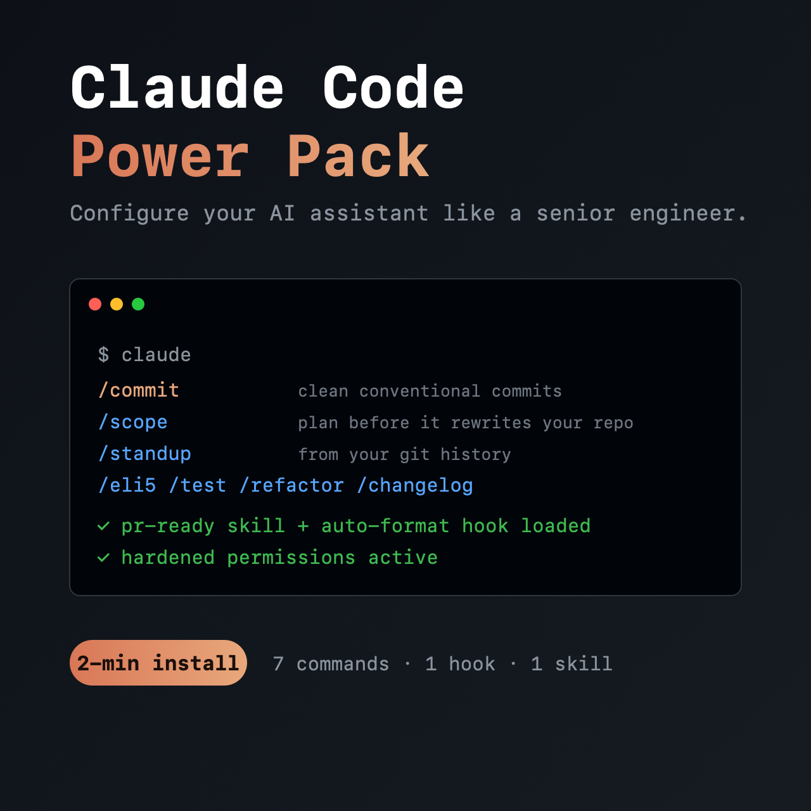

<div align="center">



# Claude Code Power Pack

**Configure your AI coding assistant like a senior engineer.**

A drop-in `.claude/` setup for [Claude Code](https://claude.com/claude-code) that you install in 2 minutes.

</div>

---

## 🆓 Free sample — `/commit` (in this repo)

This repo includes a free, working command: **`/commit`**. It reads your git diff, splits it into clean [Conventional Commits](https://www.conventionalcommits.org), and shows you the plan before committing — so you never type `git commit -m "stuff"` again.

**Install (30 seconds):**
```bash
# from your project root
mkdir -p .claude/commands
curl -sL https://raw.githubusercontent.com/ericl574/claude-code-power-pack/main/.claude/commands/commit.md \
  -o .claude/commands/commit.md
```
Restart Claude Code, type `/commit`. Done.

---

## ⚡ The full Power Pack

Like `/commit`? The full pack adds **6 more commands**, a hook, a skill, and a hardened config:

| Tool | What it does |
|------|-------------|
| `/scope` | Turns a vague request into a surgical plan **before** it rewrites your repo |
| `/standup` | Your daily standup, generated from real git history |
| `/eli5` | Explains any file, function, or error with a mental model |
| `/test` | Writes & runs focused tests for your recent changes |
| `/refactor` | A safe, incremental refactor plan — no blind rewrites |
| `/changelog` | Human-readable release notes from your git history |
| `pr-ready` skill | Self-reviews your diff and writes the PR description |
| format-on-edit hook | Auto-formats every file Claude touches (Prettier/Ruff/gofmt/…) |
| hardened `settings.json` | Auto-approves safe commands, **blocks** `rm -rf`, force-push, reading `.env` |

No filler. Each tool kills a specific daily annoyance.

### 👉 Get the full pack — **$10**

The complete pack (all 7 commands + hook + skill + hardened config) is launching as a single instant download.

⭐ **[Star this repo](https://github.com/ericl574/claude-code-power-pack)** to get notified the moment it drops — and try the free `/commit` above in the meantime.

*(Personal + commercial use. Instant download. One file, drop it in any repo.)*

---

## Why this exists

Most "AI config" packs are 50 prompts you'll never use. This is the opposite: a small set of tools that each solve a real, recurring problem — built by someone who lives in these config files.

⭐ **Star this repo** if the free `/commit` is useful — it helps others find it.
